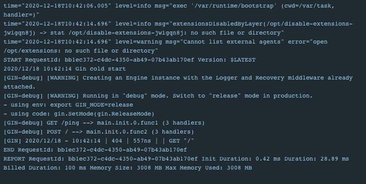

#### aws-lambda-go

Reproduces a failing example of golang on AWS Lambda using container images based on code samples from

1. https://hub.docker.com/r/amazon/aws-lambda-go
2. https://github.com/awslabs/aws-lambda-go-api-proxy


*get dependencies*

```text
go get -u github.com/gin-gonic/gin
go get -u github.com/aws/aws-lambda-go
go get -u github.com/awslabs/aws-lambda-go-api-proxy
```

*run locally*

```text
docker build -t alg-image .

docker run -d -p 9000:8080 alg-image

curl -XPOST "http://localhost:9000/2015-03-31/functions/function/invocations" -d '{"payload":"hello world!"}'
```

##### Problems

The main.go file has two endpoints below. How do you call these endPoint locally using 
the "http://localhost:9000/2015-03-31/functions/function/invocations" url?

1. GET /ping
2. POST /

Every single call to the container using the above curl request always results in 404 return 
as shown in the image below.



Even when deployed, the image always returns a 404 response 

```json
{
  "statusCode": 404,
  "headers": null,
  "multiValueHeaders": {
    "Content-Type": [
      "text/plain"
    ]
  },
  "body": "404 page not found"
}
```
